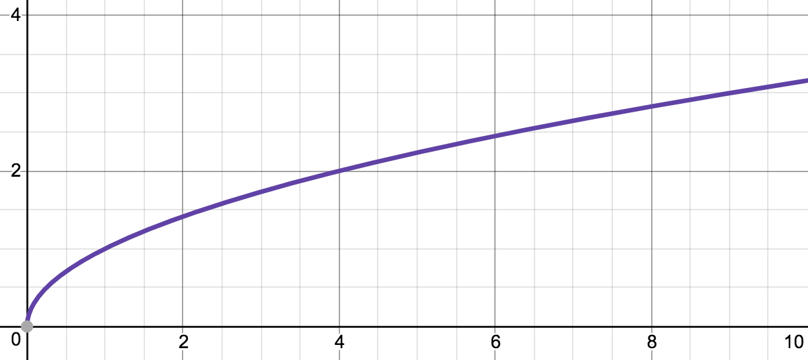
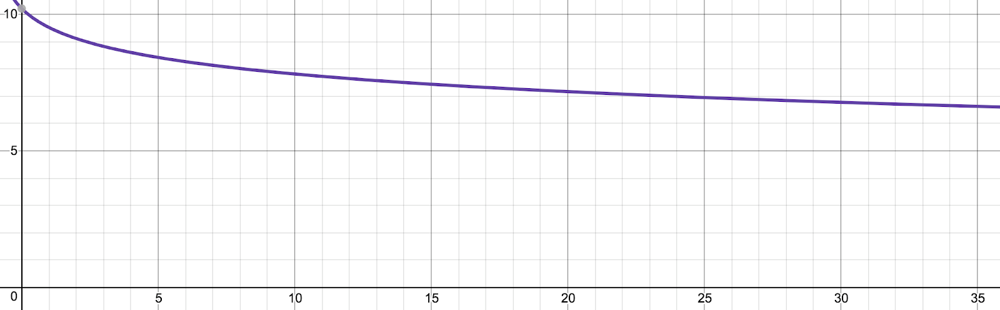
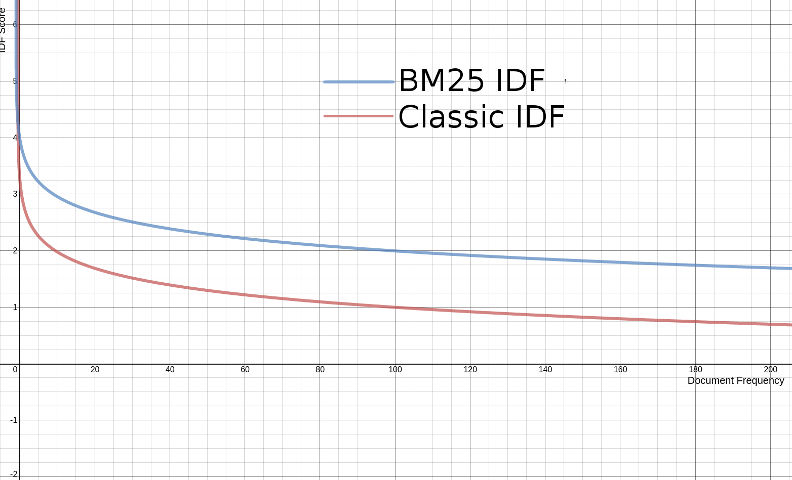
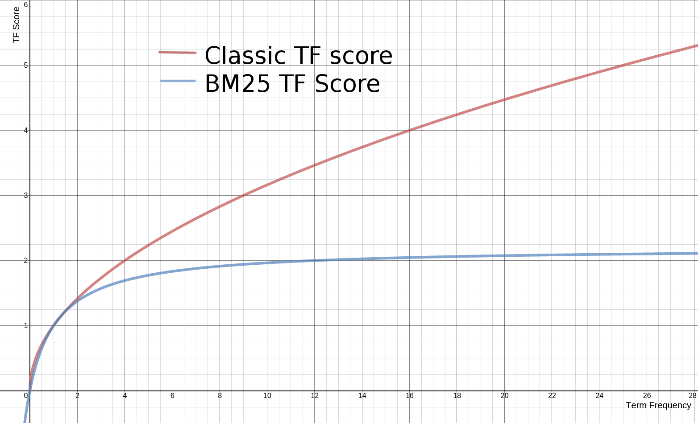
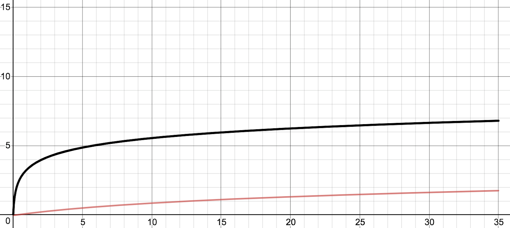

## similarity models and framework comparison

#### 1. Tf-IDF

[TF-IDF](https://en.wikipedia.org/wiki/Tf–idf)

> **TF** stands for _Term Frequency_. We’re looking at one term at a time (all similarities are doing this) and, the more often the term appears in our field, the higher the score. Lucene actually takes the square root of the TF: if you query for photoshop, a document mentioning photoshop twice is more likely about photoshop, but maybe not twice as likely as a document with only one occurrence.
> 

> **IDF** stands for _Inverse Document Frequency_. Here, Document Frequency (DF) stands for the ratio between the number of documents containing the term and all the documents of your index. For example, if you’re searching for Illustrator and planets in an Edex website dedicated to resources and courses to study, the DF of Illustrator will be very high. The IDF (Inverse DF) will be very low, because Illustrator will carry less interesting information about the documents compared to Planet which, presumably, has a higher IDF.
> 

Lucene doesn’t take IDF as simply 1/DF. It actually takes
`1 + log( (docCount+1)/(docFreq+1))`.
The idea is to tame the curve a little bit, as docFreq (number of documents containing the term) increases:

> Lucene also normalizes scores by document length. The longer the document, the more likely it is to contain that field by pure chance, so it will get a lower score
> `(score/sqrt(docLength)`
> will be the result). Here, docLength is the (approximate) number of terms in the document.

### 2. BM25

[BM25](https://en.wikipedia.org/wiki/Okapi_BM25) improves upon TF\*IDF. BM25 stands for “Best Match 25”. BM25 has its roots in probabilistic information retrieval.

###### BM25’s Take on IDF



###### BM25’s Take on TF

Without any consideration for document length, term frequency follows the formula
`((k + 1) \* tf) / (k + tf)`


> The TF part of BM25 grows asymptotically to 1+k1. k1 defaults to 1.2.
> There are two configurable values here: k1 and b. A higher k1 will imply a higher ceiling, but it will also make document length normalization more aggressive (longer documents will be penalized more)
> Length normalization is controlled by the b parameter. Higher b (defaults to 0.75) makes length matter more.

###### How Does BM25 Use Document Length?

> `((k + 1) * tf) / (k * (1.0 - b + b * L) + tf)`

introducing two variables: a constant b and a length value L.
L is how long a document is relative to the average document length. L is 2 if the document being scored is twice the corpus’s average document length. L is 0.1 if the document being scored is one tenth the average document length. L therefore is actually presented as `|d|/avgDl` – this document length divided by the average document length.
score is multiplied by IDF :

> `IDF * ((k + 1) * tf) / (k * (1.0 - b + b * (|d|/avgDl)) + tf)`

**Example** of BM25 that how it handles **stop words** better than tf-idf and other modules -
There was a time when most Ordinary words (or Stop words) Removal from the index is considered a standard practice, and TF / IDF was born in this context. TF / IDF does not consider the problem of word frequency upper limit, because high-frequency stop words have been removed. Although the importance of these words is very low, it is not useless.

> BM25 is better at handling stop words, in tf-idf we have seen that stop words being boosted more than they should when there is a large document, so its a _negative_ factor.
> BM25 solves this problem by non-linear term frequency saturation.

`Note : ` DFI and both Language models highly depends on length of the document and focus on stop words are high, So thats kind of a negative factor. BM25 offers better algorithm in handling stop words and other parameters also.

### 3. Divergence from Independence (DFI)

[Research paper](https://www.researchgate.net/profile/Bekir-Dincer/publication/237278943_A_Nonparametric_Term_Weighting_Method_for_Information_Retrieval_Based_on_Measuring_the_Divergence_from_Independence/links/02e7e5269717e072dd000000/A-Nonparametric-Term-Weighting-Method-for-Information-Retrieval-Based-on-Measuring-the-Divergence-from-Independence.pdf)
_if a term occurs in documents by pure chance, then the variable of document IDs and that of term frequencies are statistically independent._
If a term occurs in a document more times than expected, we can invalidate the assumption of independence with a certain probability. A higher probability will produce a higher score, telling us that the term is “more dependent” to the document. If the term occurs in a document less or equal than the expected number of times, we’ll just give it a score of 0

###### Expected term frequency

The expected number is:

> `docLength*totalTermFrequency/numberOfFieldTokens`

_docLength_ is the number of terms in the field of our document
_totalTermFrequency_ is the total occurrences of the search term in the index.
_numberOfFieldTokens_ is the total number of terms in the index.

> `(totalTermFrequency/numberOfFieldTokens) = probability of any term to be the search term.`

If we multiply that by the number of terms in our document (ie. its length), we get the _number times the search term should occur in the document, if we meet the assumption of independence._

###### Independence measures

With the number of expected terms, we can go ahead and compute the similarity score. We have three types of independence tests to choose from:

**_1. Standardized_**

```
(actualFrequency - expectedFrequency)/sqrt(expectedFrequency)
```

> Good at tasks that require high recall and high precision, especially against short queries composed of a few words as in the case of Internet searches. The intuition here is that score will grow linearly with frequency, but growth will be more aggressive for rare words (and/or short documents)
> Reference: https://lucene.apache.org/core/7_6_0/core/org/apache/lucene/search/similarities/IndependenceStandardized.html

**_1. Saturated_**

```
(actualFrequency - expectedFrequency)/expectedFrequency
```

> described as working well for tasks that require high recall against long queries. The intuition here is that growth is more aggressive for rare words, so documents containing them should bubble up to your top N
> Reference: https://lucene.apache.org/core/7_6_0/core/org/apache/lucene/search/similarities/IndependenceSaturated.html

**_1. chi-squared._**

```
(actualFrequency - expectedFrequency)^2/expectedFrequency
```

> _standardized formula squared_
> Meaning score will grow exponentially with frequency, even for frequent terms
> it can be used for tasks that require high precision, against both short and long queries.
> Reference: https://lucene.apache.org/core/7_6_0/core/org/apache/lucene/search/similarities/IndependenceChiSquared.html

[DFI paper](https://www.researchgate.net/profile/Bekir-Dincer/publication/237278943_A_Nonparametric_Term_Weighting_Method_for_Information_Retrieval_Based_on_Measuring_the_Divergence_from_Independence/links/02e7e5269717e072dd000000/A-Nonparametric-Term-Weighting-Method-for-Information-Retrieval-Based-on-Measuring-the-Divergence-from-Independence.pdf) recommends to keep _stop-words_
That’s because removing stop-words will pretty much arbitrarily change document length, which is a critical part of how score is calculated. DFI needs less tuning to work on diverse datasets.

### 4. Divergence from Randomness (DFR) Framework

[Orignal paper](https://eprints.gla.ac.uk/3798/1/3798.pdf)

> It's not just one model, like TF-IDF or BM25, but a framework including multiple models and normalization techniques.
> **_the term may occur in a document randomly, following a certain distribution._**
> The more our document diverges from our configured random distribution, the higher the score. We will also normalize this score in a configurable way, depending on things like document length.

###### DFR configuration

- The **base model**, which defines what our “random” distribution looks like.
- An **after-effect**, which normalizes the score of our base model based on term frequency.
- The term frequency used by the after-effect is also **normalized based on document length**.

> #### _Base search relevance models_

> 4 models from the original paper: `G, I(f), I(n) and I(ne)`

- G stands for [Geometric distribution](https://www.statisticshowto.com/geometric-distribution/), [wiki](https://en.wikipedia.org/wiki/Geometric_distribution)

  > _The more frequent the term is in the whole index, the more the score will go exponentially lower._
  > Note that we take the total count of the term into account (totalTermFreq), not the total number of documents containing the term (like the docCount we used in IDF previously).

- IN stands for Inverse(N)

  > where N is document frequency. If this sounds familiar, it’s the IDF we know and love – almost the same as in TF-IDF.

- IF stands for Inverse(Frequency)

  > like IN, but we take the total frequency of the term in the index

- INE stands for Inverse(Expected document frequency)
  > INE will produce similar scores to IN: IN is an approximation of INE – assuming document frequency is a good indicator of term frequency. In both, more frequent terms in the index will produce lower scores in a similar way to the IDF from TF-IDF.

> ##### _After-effects_

2 models from the original paper: `L and B`

- L stands for [Laplace’s rule of succession](https://en.wikipedia.org/wiki/Rule_of_succession)
  > The score function of the class actually returns 1.0 (i.e. doesn’t modify the score).That’s because the equation from the paper is 1/(1+tfn), where tfn is the normalized term frequency (see normalizing rules below). And this fraction of 1/(1+tfn) is incorporated in various ways in the base model.
- B stands for [Bernoulli](https://en.wikipedia.org/wiki/Jacob_Bernoulli)  
  `(1 + totalTermFreq)/docFreq`

  > The intuition for B is that if our term tends to appear, on average, more often in the matching documents, it is more informative. Because it’s less likely to appear in those documents by accident.

> ##### _Length-based normalization_
>
> four normalization techniques: `H1, H2, H3 and Z`

- **H1** assumes uniform distribution of frequencies.
  It will return:

  ```
  term frequency (tf) multiplied by avgFieldLength/docLength
  ```

  > avgFieldLength is the average length of this field in the index and docLength is the field length of this document.

- **H2** here, length becomes less important, as we multiply `tf by log2(1+c*avgFieldLength/docLength)`.

- **H3** is based on Dirichlet priors. comes with a parameter (mu) `(tf + mu*totalTermFreq/numberOfFieldTokens)/(docLength+mu)` higher mu will make both the term frequency and the document length matter less.

- **Z** is yet another variation based on avgFieldLength/docLength. Here we `multiply tf by (avgLength/docLength)^z`. z must be in the (0..0.5) range, meaning score will still decay less than linear, like in H2.

The [original DFR paper](https://eprints.gla.ac.uk/3798/1/3798.pdf) shows results comparable to BM25 on various datasets, with different model+aftereffect+normalization combinations coming quite close to each other.

### 5. Information-Based (IB) Models (DFI)

[Research paper](https://sematext.com/blog/search-relevance-solr-elasticsearch-similarity/#toc-divergence-from-randomness-dfr-framework-4)
IB models similar in how they work with DFR

> how much information gain do we get from this term

> Like DFR, IB comes up with different base distributions for term frequency: log-logistic (LL) and smoothed power law (SPL)

###### Probability distributions

[LL (log-logistic)](https://lucene.apache.org/core/7_6_0/core/org/apache/lucene/search/similarities/DistributionLL.html)
computes the score as the `natural logarithm of tfn/lambda + 1 `

> tfn = term frequency normalized

[SPL (smoothed power law)](https://lucene.apache.org/core/7_6_0/core/org/apache/lucene/search/similarities/DistributionSPL.html)
computes the score as the `natural logarithm of (lambda - 1)/(lambda - lambda^(1 - (1/(tfn+1))) `

###### Retrieval function (lambda)

Besides the probability distribution and the normalized term frequency, we’ll want to consider “_the average of the document information brought by each query term_”.
We’ll call this average information **lambda** , and compute it in one of two ways:

- [Document Frequency (DF)](https://lucene.apache.org/core/7_6_0/core/org/apache/lucene/search/similarities/LambdaDF.html).
  > This is simply `docFreq/docCount`, not smoothed like in TF-IDF or BM25. Where docFreq is the number of documents containing the term and docCount is the total number of documents in the index.
- [total term frequency (TTF)](https://lucene.apache.org/core/7_6_0/core/org/apache/lucene/search/similarities/LambdaTTF.html)
  > `totalTermFreq/docCount`. The difference from DF is that we care about the total occurrences of this term in the index, not just the matching documents.

### 6. Language Models (LM)

[Language models](https://en.wikipedia.org/wiki/Language_model)

> smoothing scores based on unseen words (i.e. document length).

> probability of a term in a document to be the search term

It’s somewhat similar to how DFI starts with the probability of a term to come up in a document

> we initially care only about the likelihood of any term to be our term: `totalTermFreq/totalFieldTokens`. We’ll call this proportion probability

#### 6.1 LM Dirichlet

> This model does bayesian smoothing using Dirichlet priors.
> In other words, how does the actual term frequency stack up to what a Dirichlet distribution would assume to be “normal”? This is a technique we’ve seen in the H3 normalization of DFR/IB.

> Like in H3, we have a configurable parameter (mu) which controls smoothing: higher mu values will make scores vary less.

`log(normalizedTermFrequency/normalizedDocLength)`
Here, normalizedTermFrequency would be computed as `mu + totalFieldTokens * tf/totalTermFreq`. Meanwhile, normalizedDocLength would simply be mu + docLength.

> - score would grow with the ratio of tf/totalTermFreq. If we search for “foo”, the more times “foo” occurs in this document compared to the whole index, the higher the score. Rare terms will rank logarithmically higher at the same term frequency, compared to common words. Roughly logarithmically, at least, because mu normalizes the score even further.
> - score will drop for longer documents. That said, if we have more more terms in the field to begin with (totalFieldTokens – proportional to the average document length, if the field isn’t sparse), the score would be a bit higher

#### 6.1 LM Jelinek-Mercer Smoothing

we’ll divide the document model `(tf/docLength) by that of the whole index (probability)`.
We’ll use a lambda in the range of (0..1] to control the weight of each: document model gets multiplied by 1-lambda, while the index model gets multiplied by lambda.

```
1 + (1/lambda - 1) * (tf/totalTermFreq) * (totalFieldTokens/docLength)
```

The main difference from `Dirichlet` smoothing is that in `Jelinek-Mercer,` lambda is multiplying our base factors. Meanwhile, in Dirichlet, mu is added to them.

LMDirichlet vs LMJM


> JM (black) scores grow more term frequency, compared to Dirichlet (red)

Because of this difference (adding vs multiplying), scores tend to vary more in the JM language model than in the Dirichlet one
Dirichlet tends to perform better for short (title) queries, Jelinek-Mercer is slightly better for longer queries.

### My Analysis

> - DFR and IB have almost similar performances, results are 99% same.
>   Because they use almost similar ideologies.
>   They base distribution of term frequencies are different in both frameworks, but formulas are almost similar. And retrieval and normalization system of both models are same. So, we get same results.
>   In DFR, the model has one parameter of geometrical distribution probability model, our data recommendation somewhat follows that, so I think because of this reason DFR is very slightly better than IB.

> - Also, the DFI model works on pure probability, I don't think that its a good match for us, it has some flaws also. It ranks purely on the basis of frequency independency, also it highly depends on document length, which is not much important factor because in DFI we can not tune much, we have only 3 independency measures.
>   I found one measure - 'chi-squared' which is much relevant but on the same go, in DFI it says that include stop words to increase document length.
>   So, according to me, DFI is not good.

> - And now the language models, they can be good but in specified use cases. They tend to be a slight combination of DFR and DFI, some parameters they take, but LM is mostly based on probabilities and have same consequences as of DFI. also the Dirichlet model works better on short queries and Jelinek-Mercer is slightly better for long queries. They both are probabilities and queries/length centric and I don't think LM is that much good for us as per our need of recommendation. Jelinek-Mercer is lightly better than Dirichlet as it reaches asymptotic level better than Dirichlet.

> - Now, about BM25, its performance is better than everyone as it uses non-linear term frequency saturation mechanism, basically it is asymptotically comes closer to a certain ceiling level, after which the no. of term frequencies will not outburst the system. so longer documents will be penalised much better. I was making notes and analysing things on many factors, I have done many tests and BM25 performance is slightly better than others.

> **_BM25 >~ DFR~IB > DFI ~LMJM > LMD_**

#### References

- https://opensourceconnections.com/blog/2015/10/16/bm25-the-next-generation-of-lucene-relevation/
- https://sematext.com/blog/search-relevance-solr-elasticsearch-similarity/#toc-divergence-from-randomness-dfr-framework-4
- https://elasticsearch.rainplus.xyz/v/english/15_Index_Modules/05_Similarity_module.html
- https://www.elastic.co/guide/en/elasticsearch/reference/master/index-modules-similarity.html
- https://www.wikipedia.org
- https://www.statisticshowto.com
- https://programmersought.com/article/59703488939/
